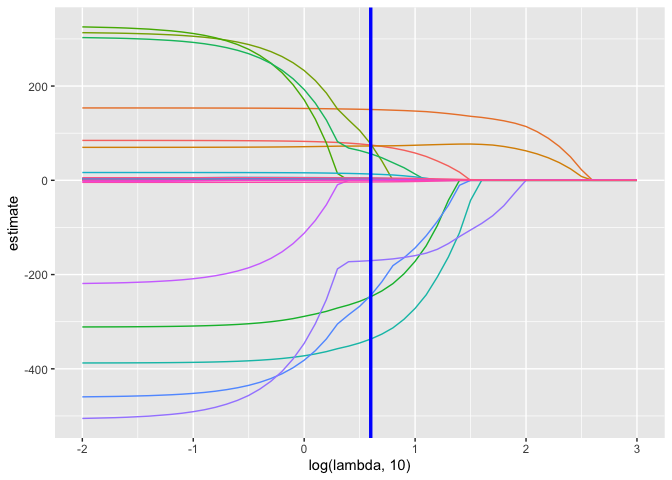
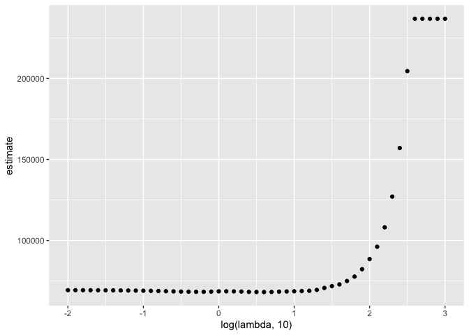
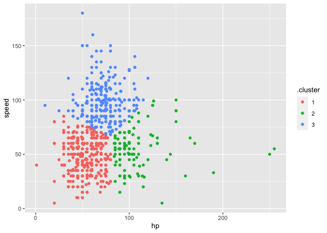
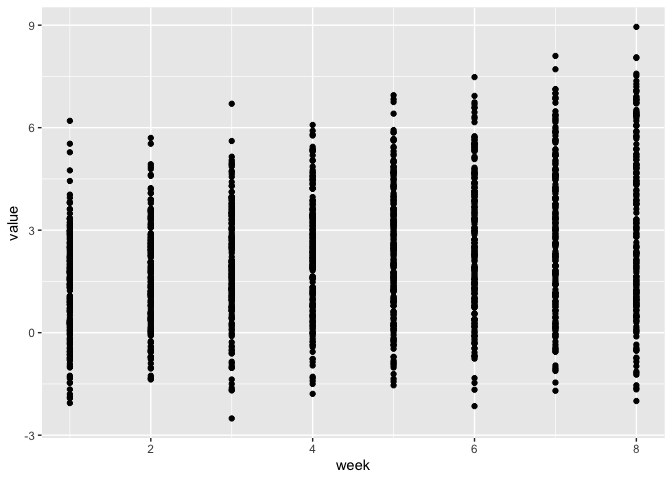
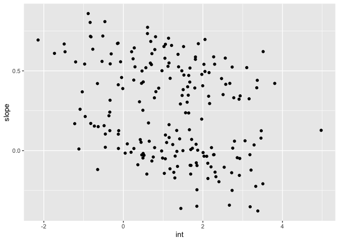
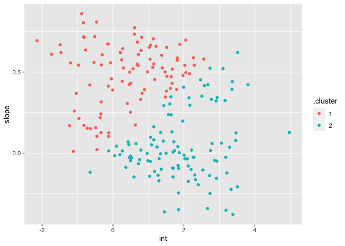
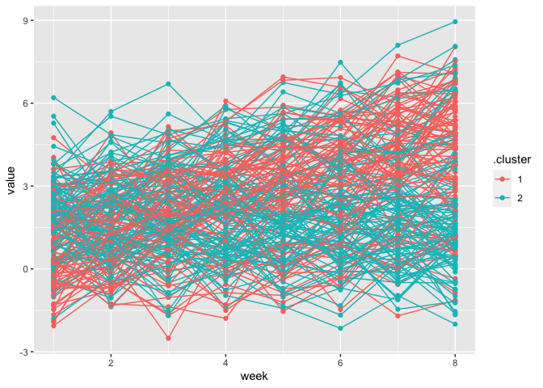

statistical_learning
================
2022-12-01

``` r
bwt_df = 
  read_csv("./data/birthweight.csv") %>% 
  janitor::clean_names() %>%
  mutate(
    babysex = as.factor(babysex),
    babysex = fct_recode(babysex, "male" = "1", "female" = "2"),
    frace = as.factor(frace),
    frace = fct_recode(frace, "white" = "1", "black" = "2", "asian" = "3", 
                       "puerto rican" = "4", "other" = "8"),
    malform = as.logical(malform),
    mrace = as.factor(mrace),
    mrace = fct_recode(mrace, "white" = "1", "black" = "2", "asian" = "3", 
                       "puerto rican" = "4")) %>% 
  sample_n(200)
```

    ## Rows: 4342 Columns: 20
    ## ── Column specification ────────────────────────────────────────────────────────
    ## Delimiter: ","
    ## dbl (20): babysex, bhead, blength, bwt, delwt, fincome, frace, gaweeks, malf...
    ## 
    ## ℹ Use `spec()` to retrieve the full column specification for this data.
    ## ℹ Specify the column types or set `show_col_types = FALSE` to quiet this message.

Inputs for `glmnet`

``` r
x = model.matrix(bwt ~ ., bwt_df)[,-1]
y = bwt_df$bwt
```

Fit lasso!

``` r
lambda = 10^(seq(3, -2, -0.1))

lasso_fit =
  glmnet(x, y, lambda = lambda)

lasso_cv =
  cv.glmnet(x, y, lambda = lambda)

lambda_opt = lasso_cv$lambda.min
```

``` r
broom::tidy(lasso_fit) %>% 
  select(term, lambda, estimate) %>% 
  complete(term, lambda, fill = list(estimate = 0) ) %>% 
  filter(term != "(Intercept)") %>% 
  ggplot(aes(x = log(lambda, 10), y = estimate, group = term, color = term)) + 
  geom_path() + 
  geom_vline(xintercept = log(lambda_opt, 10), color = "blue", size = 1.2) +
  theme(legend.position = "none")
```

<!-- -->

``` r
broom::tidy(lasso_cv) %>% 
  ggplot(aes(x = log(lambda, 10), y = estimate)) + 
  geom_point()  
```

<!-- -->

## Clustering

``` r
poke_df = 
  read_csv("./data/pokemon.csv") %>% 
  janitor::clean_names() %>% 
  select(hp, speed)
```

    ## Rows: 800 Columns: 13
    ## ── Column specification ────────────────────────────────────────────────────────
    ## Delimiter: ","
    ## chr (3): Name, Type 1, Type 2
    ## dbl (9): #, Total, HP, Attack, Defense, Sp. Atk, Sp. Def, Speed, Generation
    ## lgl (1): Legendary
    ## 
    ## ℹ Use `spec()` to retrieve the full column specification for this data.
    ## ℹ Specify the column types or set `show_col_types = FALSE` to quiet this message.

``` r
poke_df %>% 
  ggplot(aes(x = hp, y = speed)) + 
  geom_point()
```

<!-- -->

``` r
kmean_fit = 
  kmeans(x = poke_df, centers = 3)
```

``` r
poke_df = 
  broom::augment(kmean_fit, poke_df)

poke_df %>%
  ggplot(aes(x = hp, y = speed, color = .cluster)) +
  geom_point()
```

<!-- -->

#### Clusteirng: trajectories

``` r
traj_data = 
  read_csv("./data/trajectories.csv")
```

    ## Rows: 1600 Columns: 3
    ## ── Column specification ────────────────────────────────────────────────────────
    ## Delimiter: ","
    ## dbl (3): subj, week, value
    ## 
    ## ℹ Use `spec()` to retrieve the full column specification for this data.
    ## ℹ Specify the column types or set `show_col_types = FALSE` to quiet this message.

``` r
traj_data %>%
  ggplot(aes(x = week, y = value)) + 
  geom_point()
```

<!-- -->

``` r
  geom_path()
```

    ## geom_path: lineend = butt, linejoin = round, linemitre = 10, arrow = NULL, na.rm = FALSE
    ## stat_identity: na.rm = FALSE
    ## position_identity

``` r
int_slope_df = 
  traj_data %>% 
  nest(data = week:value) %>% 
  mutate(
    models = map(data, ~lm(value ~ week, data = .x)),
    result = map(models, broom::tidy)
  ) %>% 
  select(subj, result) %>% 
  unnest(result) %>% 
  select(subj, term, estimate) %>% 
  pivot_wider(
    names_from = term,
    values_from = estimate
  ) %>% 
  rename(int = "(Intercept)", slope = week)
```

``` r
int_slope_df %>% 
  ggplot(aes(x = int, y = slope)) + 
  geom_point()
```

<!-- -->

``` r
km_fit = 
  kmeans(
    x = int_slope_df %>% select(-subj) %>% scale, 
    centers = 2)

int_slope_df =
  broom::augment(km_fit, int_slope_df)
```

``` r
int_slope_df %>% 
  ggplot(aes(x = int, y = slope, color = .cluster)) +
  geom_point()
```

<!-- -->

``` r
left_join(traj_data, int_slope_df) %>% 
  ggplot(aes(x = week, y = value, group = subj, color = .cluster)) + 
  geom_point() + 
  geom_path() 
```

    ## Joining, by = "subj"

<!-- -->
